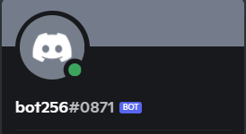
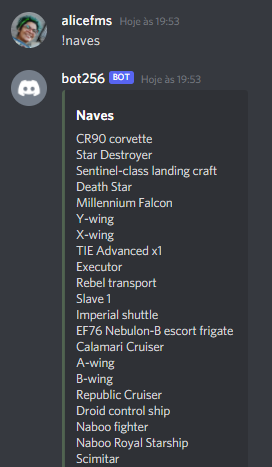
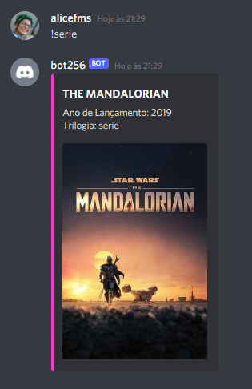

 

 # DiscordBot
 

Projeto desenvolvido durante Iniciativa Padawan, mentorada por Felipe Reinaux (@fereinaux).

Foi construído um bot que lista alguns elementos da saga Star Wars, como filmes, personagens, naves...
Para exibir os dados, o bot consulta um arquivo .json com os objetos dos filmes de toda a saga, para os demais elementos, consulta uma api pública: https://swapi.dev/

o Bot foi deployado no heroku, e é possível colocá-lo numa sala no Discord com o adm do servidor clicando neste link:

> https://discord.com/oauth2/authorize?client_id=864980471427498055&permissions=8&scope=bot

Status: falta refatorar para separar funções.

## Features: 
 

lista todos os filmes de Star Wars
- filtra filmes por trilogia
- lista planetas
- lista personages da saga
- lista espécies
- lista veículos
- lista naves

## Demonstração da Aplicação
 

 
 

 
## Pré-requisitos e como rodar a aplicação
 

Antes de qualquer coisa, voce deverá clonar este repositório na sua máquina:

>git clone https://github.com/alicefms/bot-discord.git

Depois abra o repositório na sua IDE de preferência (recomendo o VSCode) e instale os pacotes node:

>npm install

Feito isto, vode deverá gerar uma senha  para o seu Bot no próprio Discord, seguindo este passo a passo:
1. clique no link:
 https://discord.com/developers/applications/

2. Clique no botão 'New Aplications'

3. Escreva um nome para o seu bot, e clique em 'create'.

4. Vá no mnu lateral 'Bot' e clique em 'Add Bot'

5. Copie o Token ao lado do ícone do seu Bot

6. Na IDE, abra o arquivo '.env' e cole o token substituindo a palavra PASSWORD . Não são necessárias aspas, chaves ou parentesis.

Por fim, para rodar a aplicação digite no terminal 
> node app.js

## Tecnologias utilizadas
 

- nodeJs
- JavaScript

## Autora
 
Alice de Fátima Moraes Souza

github: https://github.com/alicefms

linkedIn: https://www.linkedin.com/in/alicefms/

